# Human-held device WiFi indoor localization dataset

We construct a human-held device WiFi indoor localization dataset (**H-WILD**), consisting of approximately **120k** data points collected from ten volunteers across **four** classic indoor scenarios. 

## Table of contents

[toc]

## Updates

- ***2023/05***

*Beta-v0.1 (For review only)*: First commit.

- ***2023/07***

*Beta-v0.2 (For review only)*: Supplement the content of "Dataset Introduction" and "Dataset Structure" in detail. 

- ***2023/10***

Public release: Please stay tuned for updates and feel free to contact [me]([Tianyu Zhang - Homepage (ray-ui.github.io)](https://ray-ui.github.io/)) (tianyuzhang@mail.ustc.edu.cn) if you have any questions or need further information.

## Dataset Introduction

### Why we made a human-held device dataset?

The public [Robot-based Dataset]([WCSNG - Research (ucsd.edu)](https://wcsng.ucsd.edu/wild/)) employs a robot equipped with Simultaneous Localization And Mapping (SLAM) technology to gather ground truth location estimates corresponding to wireless channels. However, real-world usage scenarios often involve users holding their devices in their hands, introducing additional effects such as occlusion caused by human bodies that are not modeled in existing localization system architectures. To address this gap, we generalize the scenario from robot-held to human-held devices.  We believe this dataset would facilitate future research on WiFi-based localization and tracking.

###  How was your data collected and annotated?

<div align="center">
    <a>
    	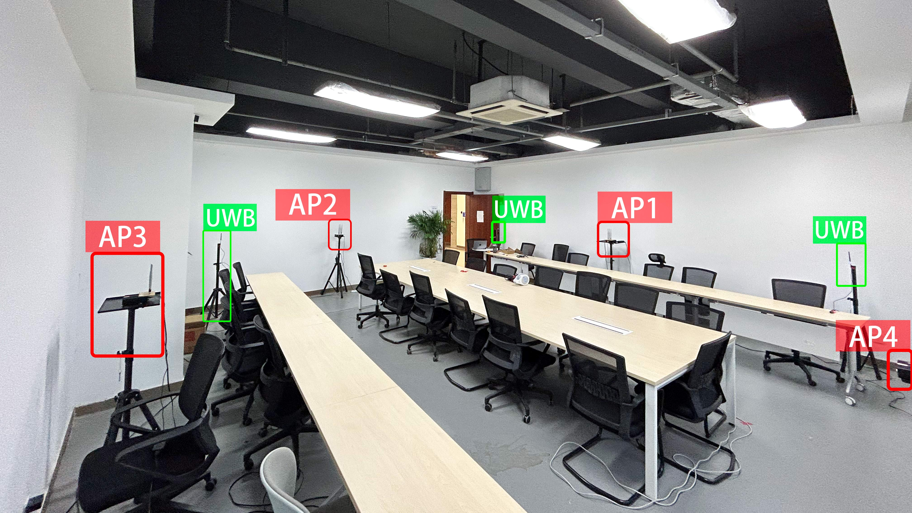 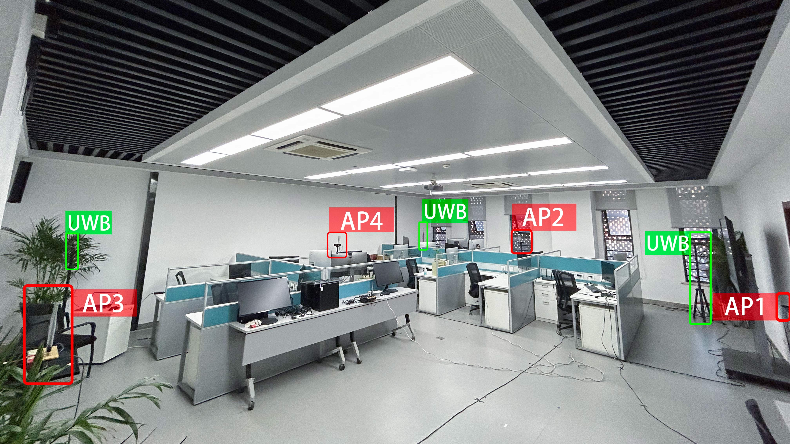 
    </a>
</div>

<center><p> Conference & Office</p></center>

<div align="center">
    <a>
    	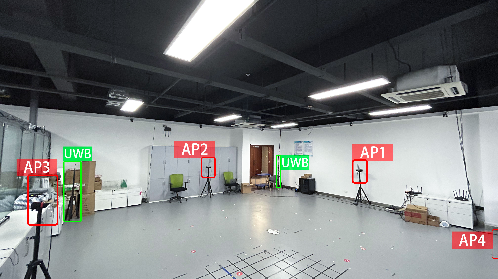 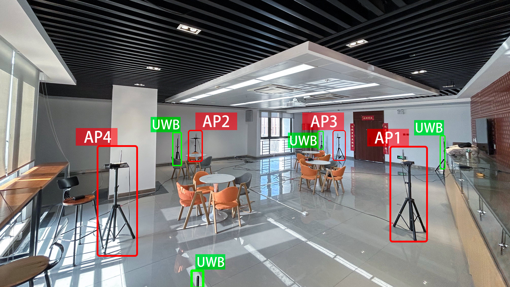 
    </a>
</div>

<center><p> Laboratory & Lounge </p></center>

*(Please note that there are four UWB tags in each environment. Some UWB tags may not be labeled in the image.)*

| Environments | Room Size | AP Number |                        Description                         |
| :----------: | :-------: | :-------: | :--------------------------------------------------------: |
|  Conference  |  8m × 8m  |     4     |    Simple LOS-based environment in the conference room.    |
|  Laboratory  | 9m × 10m  |     4     |      Simple LOS-based environment in the laboratory.       |
|    Office    | 9m × 11m  |     4     |     Complex High-multipath environment in the office.      |
|    Lounge    | 11m × 14m |     4     | Complex High-multipath and NLOS environment in the lounge. |

We collect datasets in four typical indoor scenarios: conference, laboratory, office, and lounge. During data collection, volunteers are instructed to walk freely around the room while holding the transmitter in their hands. They can walk slowly, walk quickly, or stop, just as they normally would do during their daily activities. Each volunteer walks alone for 6 minutes and then with other persons, who could potentially cause interference, for 3 minutes.  And we use an Ultra-Wideband (UWB) based localization system with an accuracy of ten of centimeters to collect ground truth location data. 

For more detailed information about the dataset, please refer to the "Dataset" section in the paper. 

## Dataset structure

### Filename

The format of each .mat filename follows the pattern "RoomName_APName_VolunteerID_InterferenceState". For instance, the filename "Lounge_sRE4_user1_w" indicates that the data was collected in the Lounge, using AP sRE4, with the target user ID 1, while there was simultaneous interference from other individuals. Similarly, the filename "Lab_sRE5_user5_wo" indicates that the data was collected in the Laboratory, using AP sRE5, with the target user ID 5, and there was no interference from other individuals. 

### Data

Each .mat file contains a total of six variables, as shown in the table below:

|  Variable Name   |                         Description                          |
| :--------------: | :----------------------------------------------------------: |
| estimations_aoa  |          The estimated angles obtained from 2D-FFT.          |
|   features_csi   | The measured CSI information is provided in the format of 1x90. Specifically, it consists of data from three antennas, with each antenna capturing 30 subcarriers. |
|  features_rssi   | The measured RSSI information,  with each RSSI formatted as 1x3. |
|   features_agc   |                The measured AGC information.                 |
|    labels_aoa    |                      The label angles.                       |
| uwb_coordinate_x | The X-axis coordinates obtained from the UWB positioning system. |
| uwb_coordinate_y | The Y-axis coordinates obtained from the UWB positioning system. |

### Descriptive statistics

This section presents the statistical analysis of the angle of arrival (AoA) and trajectory data for four typical indoor rooms. 

The "AoA statistics" subfigure provides an overview of the distribution of the true AoA for each AP as well as the overall distribution of the true AoA across all APs. 

The "2D floor plan" subfigure displays the distribution of the dataset's trajectories, with the positions of the APs represented by red dots.

- Conference

  <div align="center">
      <a>
      	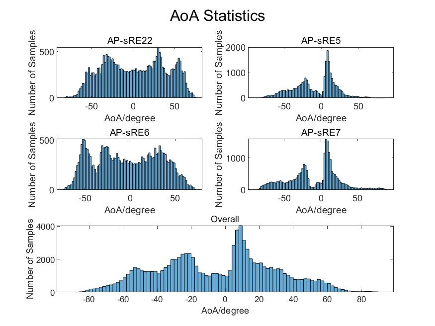 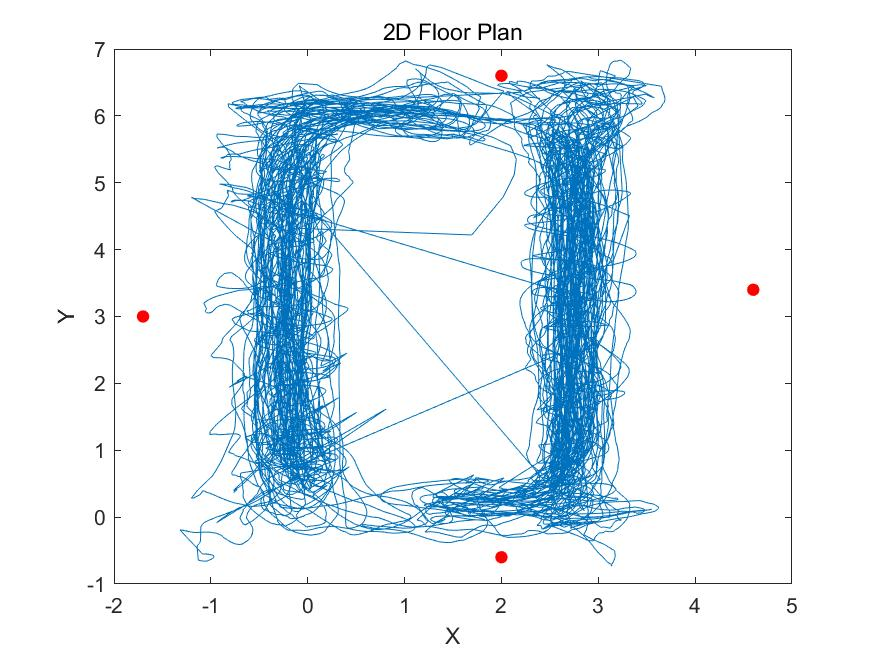 
      </a>
  </div>

- Office

  <div align="center">
      <a>
      	 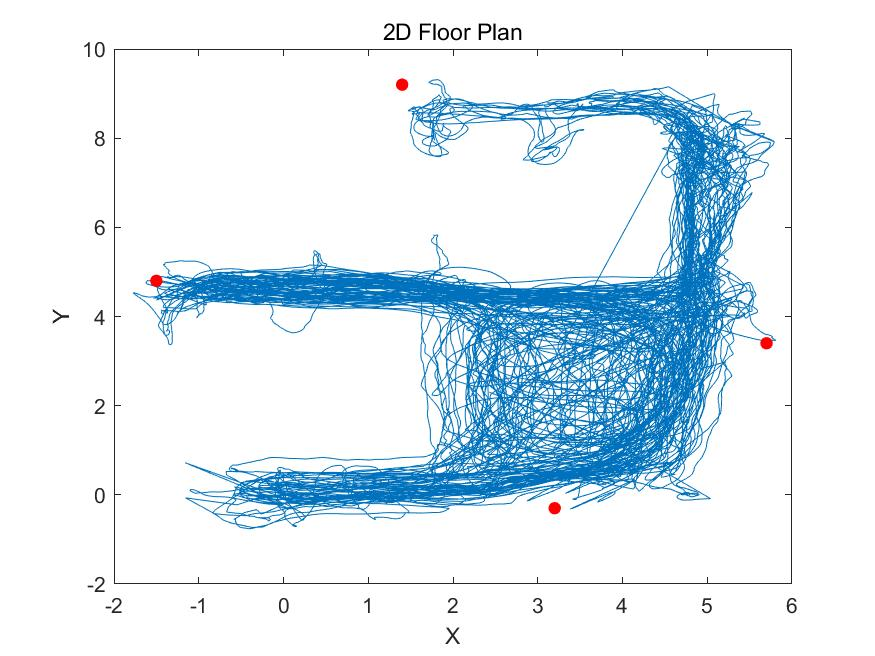 
      </a>
  </div>

- Laboratory

  <div align="center">
      <a>
      	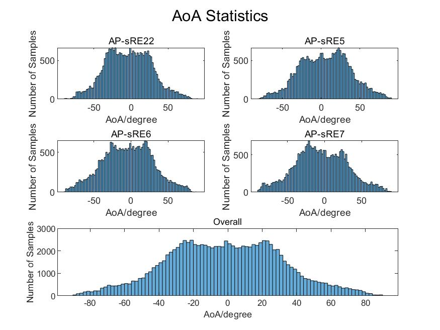 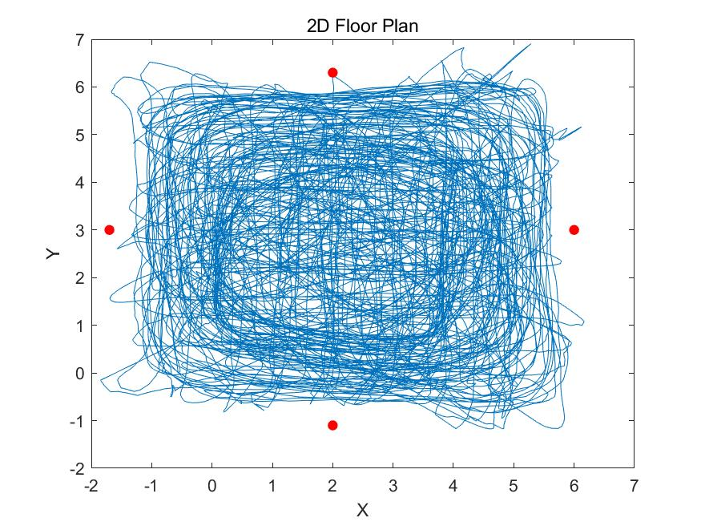 
      </a>
  </div>

- Lounge

<div align="center">
    <a>
    	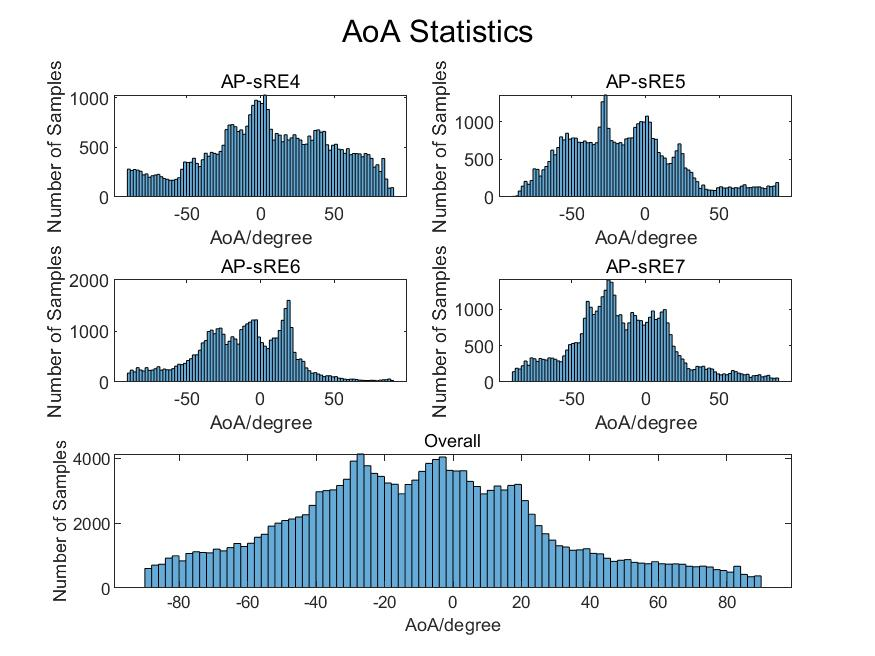 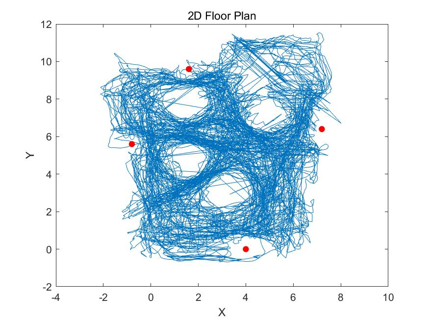 
    </a>
</div>


##  "Show me the code."

Here, through a few simple demo programs, we will guide you on how to quickly get started with this dataset. 

First, you need to download the dataset and code to your computer. Make sure you have **MATLAB** software installed on your computer. 

### Load specific data.

As mentioned earlier, each filename in our dataset carries a specific meaning. You can simply use the filename as an index to open the desired data.

For example, if you want the data for "Lounge", 'sRE5', 'user3', and 'w', you just need to run **Part 1** of the **demo.mat**. 

```matlab
room_name = 'Lounge'; % Lounge,Office, Lab, Con.
ap_name = 'sRE5'; % sRE4, sRE6, sRE7, sRE22
user_id = '3'; % 1-5/1-7.
wo_interference = 'w';
```

You can also choose from the following table to select the desired data based on the specific scenarios you are interested in.

| Room Name |       AP Name        | user_id | 
| :-------: | :------------------: | :-----: | 
|  Lounge   | sRE4,sRE5,sRE6,sRE7  |   1-7   |  
|  Office   | sRE22,sRE5,sRE6,sRE7 |   1-5   | 
|    Lab    | sRE22,sRE5,sRE6,sRE7 |   1-5   | 
|    Con    | sRE22,sRE5,sRE6,sRE7 |   1-5   | 

*Note: The 2D-FFT angle estimation results of the sR22 device are slightly worse. Pay attention to the differences between different devices when using them. 

### Experience the variation of Angle of Arrival (AoA).

You can run Part 2 of the `demo.mat` to experience the variation of AoA with the number of packets. 

<div align="center">
    <a>
    	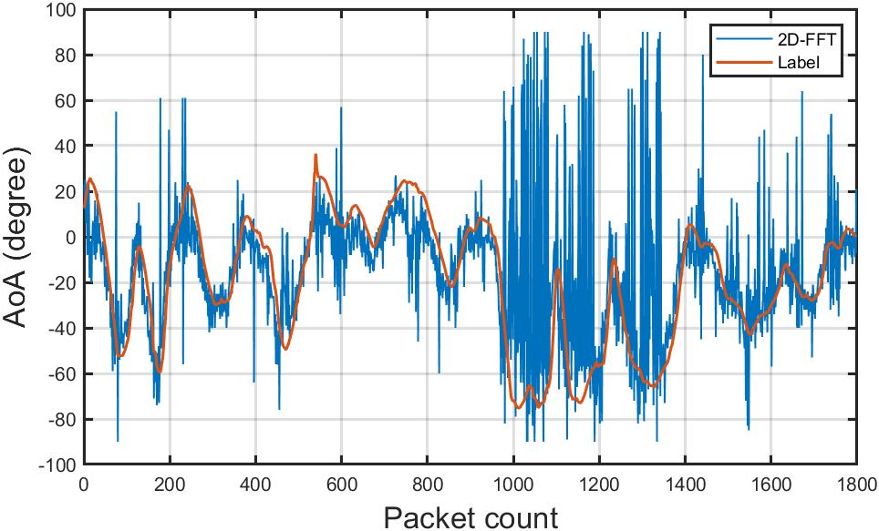 
    </a>
</div>


### Experience the variation of the trajectory.

You can run Part 3 of the `demo.mat` to observe the variation of the trajectory.

This figure displays the labeled trajectory of the target person, along with the positions of each AP in space. 

<div align="center">
    <a>
    	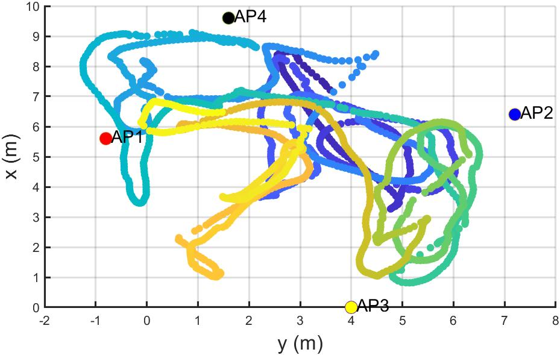 
    </a>
</div>


### Experience the example of the localization.

You can run Part 4 to experience a simple triangulation-based localization.

It demonstrates the results of traditional triangulation-based localization using the angle estimation results based on 2D-FFT. 

The heatmap representation of triangulation shows the likelihood of the target being present at each position in space, with smaller values indicating higher probabilities.

All the AP positions and orientations are integrated in the code example, and you can find them in the `obtain_parameters.m` file.


<div align="center">
    <a>
    	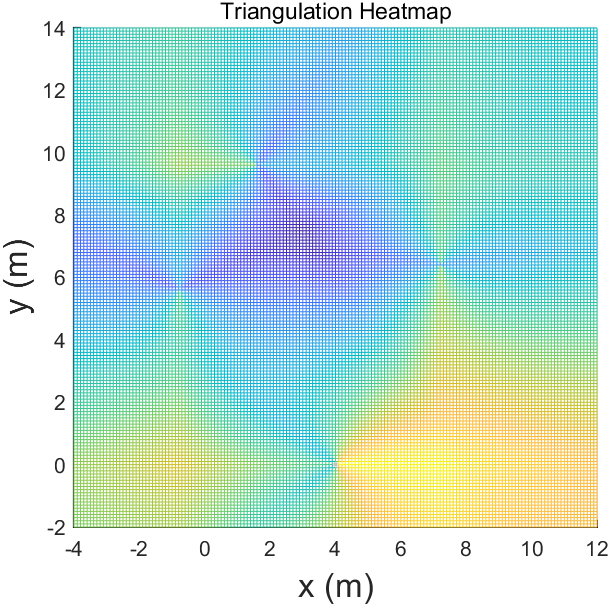 
    </a>
</div>


Simultaneously, the results of triangulation are also displayed in the following figure.


<div align="center">
    <a>
    	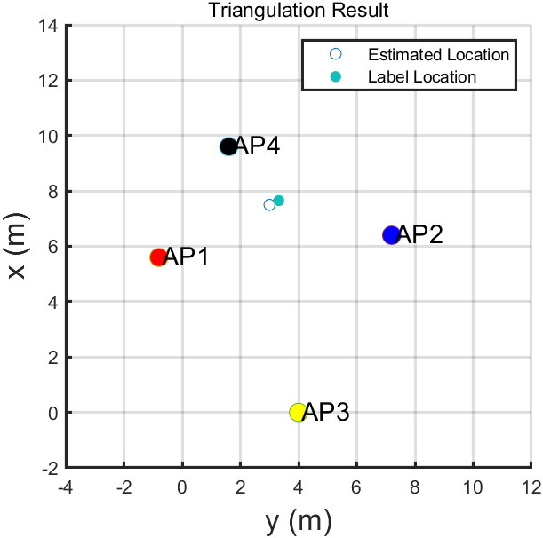 
    </a>
</div>


### Experience the Amplitude of CSI.

Part 5 guides us on how to extract and utilize CSI (Channel State Information) data. 

You can gain an understanding of our CSI format through this example.


<div align="center">
    <a>
    	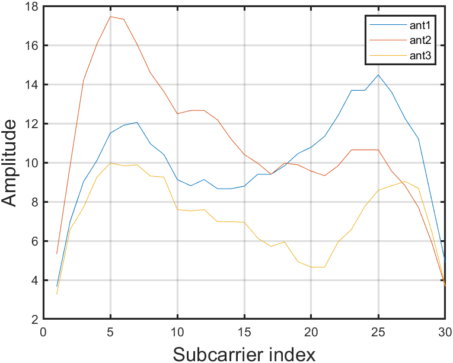 
    </a>
</div>


We believe that with these basic example codes, you will be able to quickly get started with our constructed dataset and extend it to various upstream tasks.

Good Luck.  :)

## Citation

If you use this dataset, please cite our paper.
> @article{zhang2024rloc,
  title={RLoc: Towards Robust Indoor Localization by Quantifying Uncertainty},
  author={Zhang, Tianyu and Zhang, Dongheng and Wang, Guanzhong and Li, Yadong and Hu, Yang and sun, Qibin and Chen, Yan},
  journal={Proceedings of the ACM on Interactive, Mobile, Wearable and Ubiquitous Technologies},
  volume={7},
  number={4},
  pages={1--28},
  year={2024},
  publisher={ACM New York, NY, USA}
}

## References

- [1] [Linux 802.11n CSI Tool]([Linux 802.11n CSI Tool (dhalperi.github.io)](https://dhalperi.github.io/linux-80211n-csitool/))
- [2] [Wireless Indoor Localization Dataset (WILD)]([WCSNG - Research (ucsd.edu)](https://wcsng.ucsd.edu/wild/))

